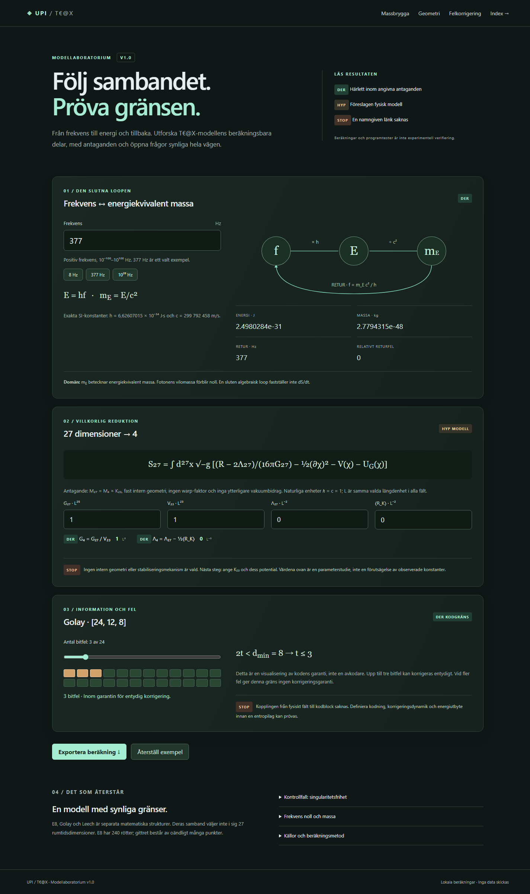

# Universal Physics Index (UPI)

**Explore physical relationships, record assumptions, and trace every claim to its evidence.**

UPI combines a machine-readable knowledge index, a Python CLI and API, and an
interactive model laboratory. Records distinguish established results, derivations,
hypotheses and unresolved questions. The laboratory lets you calculate the parts
of a proposed model that are defined and inspect the boundaries that remain open.

**Version 1.0.0** · [Svenska](README.sv.md) · [Changelog](CHANGELOG.md) · [Contributing](CONTRIBUTING.md)

[Quick start](#quick-start) · [Laboratory](#model-laboratory) · [Hosting and updates](#hosting-and-updates) · [Evidence model](#evidence-model) · [Documentation](#documentation)

<p align="center">
  
</p>

## What is included?

| Component | What it does | Where it runs |
|---|---|---|
| **Canonical index** (`data/`) | Stores typed scientific records, sources and relations in Git | Repository; read by the CLI |
| **Model laboratory** (`/lab`) | Calculates the mass bridge, conditional dimensional reduction and coding bounds | Local Python server or a static web host |
| **Contribution UI and API** (`/`) | Validates submissions and collects records in a database | Python server with SQLite or PostgreSQL |
| **External RNA explorer** | Presents a separate explorer of the index | Separately hosted application |

In project terminology, **DNA** means the canonical Git records and **RNA** means
a view or application built from those records. Reviewed records on `main` are
authoritative; a local draft or an external display does not automatically update them.

## Quick start

Run these commands from a repository checkout with **Python 3.10 or newer**:

```bash
python -m venv .venv
# Windows PowerShell:
.venv/Scripts/python.exe -m pip install -e ".[dev]"
.venv/Scripts/python.exe -m upi.cli serve --host 127.0.0.1 --port 8080
```

On macOS/Linux, replace `.venv/Scripts/python.exe` with `.venv/bin/python`.
If you already have an installed environment, start it with `upi serve`.

| Open in your browser | Purpose |
|---|---|
| [localhost:8080/lab](http://127.0.0.1:8080/lab) | Interactive model laboratory |
| [localhost:8080/](http://127.0.0.1:8080/) | Contribution form and collected records |
| [localhost:8080/api/health](http://127.0.0.1:8080/api/health) | API health check |

The server must remain running while you use these local addresses.
The contribution service defaults to a local SQLite database; see
[database and review-token setup](docs/CONTRIBUTE_UI.md) for configuration.

## Model laboratory

The Swedish UI contains three interactive calculations:

| Tool | Change | Read the result |
|---|---|---|
| **Frequency ↔ mass** | Frequency in Hz, including selectable examples | Energy, energy-equivalent mass, inverse frequency and round-trip error |
| **27D → 4D reduction** | Internal volume, gravitational coupling and curvature | Conditional effective coupling and cosmological constant |
| **Golay [24,12,8] bound** | Number of bit errors | Whether the error count is within the guaranteed correction radius |

Use **Spara parametrar** to retain values in the current browser. **Läs in JSON**
loads parameters from an exported calculation; **Exportera beräkning** downloads
inputs, results, units, assumptions and open questions. **Återställ exempel**
resets the current form, while **Rensa sparade parametrar** removes saved settings.

Settings stay on your device. The static laboratory has no account login or shared
settings database. The Golay display shows a mathematical bound, not a decoder.
The 27D construction is a proposed model with explicit assumptions.

See [laboratory equations, controls and scope](docs/TEAX_LAB_V1.md).

## Hosting and updates

### Static UI on a web host

The laboratory uses HTML, CSS and JavaScript, so its calculations and settings work
without a Python process on the host. Build it locally:

```powershell
.venv/Scripts/python.exe -m upi.site
```

Each build creates:

- `dist/upi/` — the static website with relative links and hashed assets.
- `dist/upi-webbhotell-v1.zip` — a refreshed, verified archive containing the `upi/` folder.

Extract the archive in your domain's document root to serve `/upi/`. The intended
address for this installation is `https://wadenholt.se/upi/`.

**Publication status, 2026-09-09: prepared locally; remote publication is blocked.**
The server answered on SFTP port 22, but authentication was rejected. Valid SFTP
credentials and the account's document root must be confirmed before uploading.

### Update with one command

With `uv` installed, the PowerShell updater builds your **current local source**
and uploads it over SFTP:

```powershell
./Update-UPI.ps1
```

It prompts for the password, verifies uploaded bytes, preserves the previous
entry point and switches the new page into place last. It does not pull or merge
Git changes. Use `./Update-UPI.ps1 -BuildOnly` to refresh the local package only.

For custom connection settings, Windows script-policy handling, host-key checks
and rollback instructions, see [One.com publishing guide](docs/ONE_COM_UI.md).
Credentials are never included in the website bundle.

### Full UPI service

The contribution API and database features require a Python application host.
The repository includes a local Docker Compose setup with PostgreSQL:

```bash
docker compose up --build
```

The Compose file is a development configuration. Configure credentials, persistent
storage and HTTPS for a public service. See [architecture](docs/ARCHITECTURE.md)
and [contribution service](docs/CONTRIBUTE_UI.md).

## Evidence model

| Status | Meaning |
|---|---|
| `EST` | Established within the declared domain |
| `DER` | Derived from specified facts and assumptions |
| `HYP` | A falsifiable hypothesis awaiting verification |
| `STOP` | A named proof, mechanism or observation is missing |
| `ERR` | Invalid, contradicted or superseded |
| `SYM` | A symbolic interpretation or analogy |

An address identifies a record: `UPI<Domain,Generation,Torus,Node>`.
Relations connect records without erasing their assumptions or status.
Public and model-generated submissions cannot assign `EST`.

For example, combining a specified quantum energy `E = hf` with its
energy-equivalent mass gives `m_E = hf/c²`. Its inverse is `f = m_E c²/h`.
This composition is `DER`; it does not give a photon a nonzero rest mass or
establish a separate information-mass mechanism.

```python
from upi import frequency_from_mass, mass_from_frequency

mass_kg = mass_from_frequency(377.0)
recovered_hz = frequency_from_mass(mass_kg)
```

A round trip checks consistency within a declared domain. Software tests are
labeled `verification_type: software_test`; they do not establish experimental
verification, entropy reduction or singularity freedom. Frequencies such as
7.834, 8 and 377 Hz are configurable examples, not universal constants.

Read the [mass-equivalent record](data/information_physics/frequency_mass_equivalent.json)
and [collaborative discovery method](docs/COLLABORATIVE_DISCOVERY.md).

## Work with the index

```bash
upi validate data/constants/planck.json
upi graph data
upi hypotheses data
upi triage data --inspect --known examples/ledger/baselines/known-findings.json
```

To contribute from an AI model, use the [remote indexer prompt](prompts/upi-remote-indexer.system.md)
and [example batch](examples/batches/upi-remote-batch.example.json), then validate
before inserting into the collection database:

```bash
upi ingest upi-batch.json --check
upi ingest upi-batch.json --insert --database sqlite:///upi.db
upi merge-check --data-root data
```

Canonical Git changes require maintainer review. Source text is data, never
executable authority. The [remote indexing guide](docs/REMOTE_INDEXING.md) explains
the complete prompt → batch → validation → review flow.

## External explorer and open questions

The [RNA explorer](https://upi-built-by-agi-teax.grok.me) is a separate application.
Building or publishing this repository's `/lab` UI does not deploy that explorer.

<details>
<summary>View the external explorer screenshots</summary>


</details>

The [Indaleko payload record](data/open-problems/indaleko_160tb_payload_stop.json)
is an example of a named `STOP`: the meaning of the cited 160 TB payload remains
an open provenance question. See [issue #8](https://github.com/dpstudio-se/Universal-Physics-Index-UPI/issues/8).
Universal Physics Index is distinct from the Unified Personal Index discussed
in that record.

## Verification

With the development dependencies installed and Node.js 18+ available:

```bash
python -m pytest tests -q
node --test tests/test_lab_math.cjs
ruff check src tests
mypy src/upi --ignore-missing-imports
```

Run these commands in the installed environment. On restricted Windows systems,
use a fresh `--basetemp=.pytest-tmp/your-run` and `-p no:cacheprovider` if the default
pytest directories are inaccessible. Local test results, browser checks and
deployment checks have separate scopes; see the laboratory and publishing guides.

## Repository structure

```text
data/                       Canonical scientific records and sources
schemas/                    Public JSON contracts
src/upi/                    Python package, CLI and API
src/upi/contribute/static/   Contribution UI and model laboratory
src/upi/site.py             Static builder and SFTP publisher
Update-UPI.ps1              Build and publish command
projects/resonancefs/        Separate storage prototype
prompts/                    Remote model instructions
examples/                   Example submissions, workflows and ledgers
tests/                      Python and JavaScript verification
docs/                       Guides, model boundaries and screenshots
dist/                       Generated packages; not committed
```

## Documentation

| Start here when you want to… | Guide |
|---|---|
| Understand the laboratory | [Model laboratory v1](docs/TEAX_LAB_V1.md) |
| Publish or update the static site | [One.com UI deployment](docs/ONE_COM_UI.md) |
| Configure the API and database | [Contribution UI](docs/CONTRIBUTE_UI.md) |
| Submit records through an AI model | [Remote indexing](docs/REMOTE_INDEXING.md) |
| Understand statuses and evidence | [Status model](docs/STATUS_MODEL.md), [provenance](docs/PROVENANCE.md) |
| Explore a new conceptual proposal | [Collaborative discovery](docs/COLLABORATIVE_DISCOVERY.md) |
| Work on the repository | [Contributing](CONTRIBUTING.md), [agent contract](docs/VSCODE_AGENT_PROMPT.md) |
| Understand workflows and recovery | [Governed system](docs/GOVERNED_SYSTEM.md), [resilience control](docs/RESILIENCE_CONTROL.md) |
| Track compatibility and future work | [Migration](docs/MIGRATION.md), [roadmap](ROADMAP.md) |

## License and citation

MIT — see [LICENSE](LICENSE). Citation metadata is available in [CITATION.cff](CITATION.cff).

## Research and typed DNA execution

`upi dna-derive 1.766 --time 0.25` reads the catalog and emits typed calculation candidates.
`upi dna-dynamic examples/dynamics/frequency-series.json` verifies sampled frequency
dynamics and emits dynamic candidates. See [dynamic controls](docs/DYNAMIC_SPIRAL_FLOW.md).
`upi research examples/research/session-8200.json` maps partial and open research.
See [DNA execution and its bounds](docs/DNA_EXECUTION.md) and the
[research operating prompts](prompts/upi-research-master.md). These commands do not promote records.
