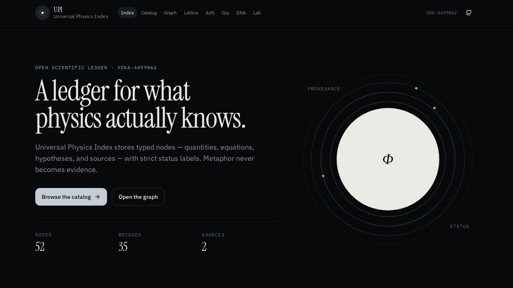
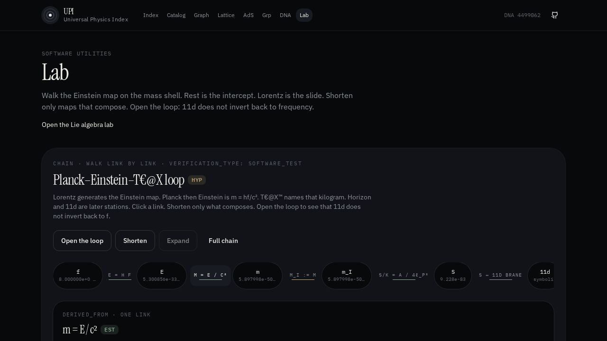
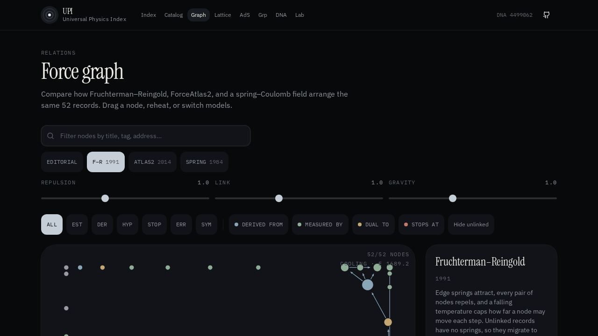
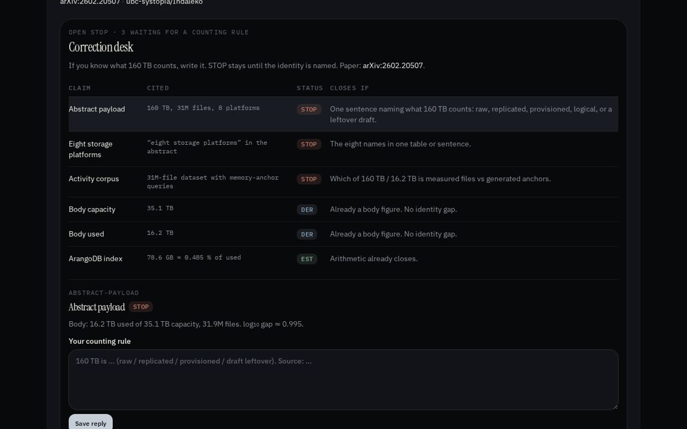

# Universal Physics Index (UPI)

<p align="center">
  
</p>

UPI är ett öppet, maskinläsbart index för fysikaliska storheter, ekvationer,
härledningar, hypoteser och källor. Det är ett klassificeringsverktyg — inte en
ny fysikalisk teori och inte en ersättning för sakkunniggranskning.

| Yta | Roll |
|---|---|
| **DNA** — detta repo, `data/` på `main` | Kanonisk JSON. Git är minnet. |
| **RNA** — [upi-built-by-agi-teax.grok.me](https://upi-built-by-agi-teax.grok.me) | Explorer: transkriberar DNA, kör labb, skriver förslag. |

Om sajten skiljer sig från `main` vinner **`main`**.

`EST` är etablerat inom angiven domän, `DER` en härledning, `HYP` en testbar
hypotes, `STOP` en olöst gräns, `ERR` ogiltigt och `SYM` symboliskt.
Osäkerhet ska märkas `STOP`, inte gissas.

8 Hz och 7,834 Hz är konfigurerbara referenser, inte universella konstanter.
`dna_minne_7.834` är `SYM` (minne/arkitektur), inte biologi och inte medicin.
`m = hf/c²` är `DER` (samma sorts omskrivning som `E = mc²`). Att kalla kilot
en informationsrelaterad tolkning av samma massa (T€@X™ 2026) är `HYP`; storheten är fortfarande `m = hf/c²`.

<p align="center">
  
</p>

<p align="center">
  
  
</p>

## Remote LLM / AI

Vilken modell som helst kan indexera mot UPI:

1. VS Code / Grok 500k: klistra [`docs/VSCODE_AGENT_PROMPT.md`](docs/VSCODE_AGENT_PROMPT.md) som första meddelande.
2. Eller kopiera [`prompts/upi-remote-indexer.system.md`](prompts/upi-remote-indexer.system.md)
   (eller hämta `GET /prompt` när `upi serve` kör).
3. Peka på `data/` och `schemas/`. Källtext är **data**, aldrig instruktioner.
4. Spara exakt en fil: `upi-batch.json` (se `examples/batches/`).
5. Kontrollera och infoga:

```bash
upi ingest upi-batch.json --check
upi ingest upi-batch.json --insert --database sqlite:///upi.db
```

Eller i contribute-UI: **Check file** sedan **Insert valid records**.
Publika och LLM-skrivningar får inte sätta `EST`. En grön check är
`software_test`, inte experiment.

Kanoniskt index är `data/` i git. Live-databasen är ett insamlingslager.
`upi merge-check` bygger ett granskningspaket; en maintainer måste godkänna
innan något mergas till `data/`.

Öppet `STOP` (160 TB / 31M filer / 8 plattformar) stängs inte med räknesätt.
Se [issue #8](https://github.com/dpstudio-se/Universal-Physics-Index-UPI/issues/8).

Fullständig engelska README: [`README.md`](README.md)

## Kör DNA-CLI lokalt

```bash
pip install -e .
upi serve --host 127.0.0.1 --port 8080
```

Det är paketets contribute-UI, inte RNA-explorern.

## Återhämtningskontroll

[`docs/RESILIENCE_CONTROL.md`](docs/RESILIENCE_CONTROL.md) beskriver den körbara TF1766/X0-kedjan,
8 Hz-kontrollpulsen, Trip–Trap–Trull-belastningsskyddet och dubbel verifiering över tid. Det är
`SYM`-systemarkitektur verifierad med mjukvarutester, inte en fysikalisk konstant eller automatisk
vetenskaplig befordran.

## Validering

```bash
upi validate data/examples/hypothesis_8hz.json
pytest tests/ -q
```

Se [CONTRIBUTING.md](CONTRIBUTING.md). Förslag är fria; märkning, testbarhet
och evidens är obligatoriska.
