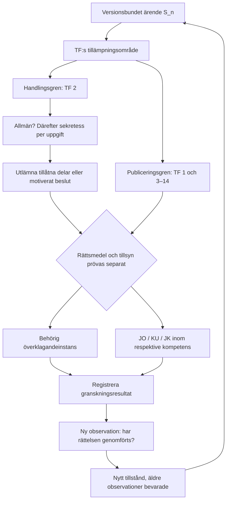

# ODEN: sex kontroll-loopar för tryckfrihetsförordningen

Modellen följer information, ansvar och rättsmedel genom en versionsbunden regelkarta.
Den bevarar underlaget när ett steg inte kan avgöras. Alla 14 kapitel är funktionstaggade;
det innebär inte att varje rättsfråga kan avgöras automatiskt.

Katalog: [samtliga paragrafposter](TF_PARAGRAPH_MAP.md),
[fullständig JSON](../examples/legal/tf-workload.json),
[förlustfria källögonblicksbilder](../examples/legal/source-snapshots.zip).

## Vad som faktiskt har slutits

EST: Riksdagens TF-text, SFS 1949:105 ändrad t.o.m. SFS 2022:1524, innehåller 193
paragrafankare: 189 gällande bestämmelser och fyra historiska markörer i kapitel 4.
TF 4:6, 4:8 och 4:9 är omnumreringsnotiser; 4:7 är upphävd. De bevaras men räknas
inte som gällande regler. TF 7:14a ingår. Övergångsbestämmelser ligger utanför dessa
193 paragrafposter och kräver egen prövning vid historiska fall.

EST: källtexten är hämtad 2026-09-10. Original-HTML för TF, RF, JO-instruktionen och
OSL finns i ZIP-arkivet; SHA-256 för varje originalfil finns i katalogen. Utdragen
har dokumenterad whitespace-normalisering, men originalen bevaras oförändrade.
Varje paragraf har eget text-hashvärde, källankare, rubrik och lagrums-ID.

DER: funktionstaggarna är en läsmodell. SOURCE, INPUT, ACCESS, BOUNDARY, EXCEPTION,
IDENTITY, RESPONSIBILITY, REVIEW, SANCTION och FEEDBACK är inte lagens egna kategorier.
Rättsliga påståenden ska alltid kunna återföras till den fullständiga paragrafen.

## A — ROOT-TRACE

För varje port finns nu en körd bakåtspårning med aktuell lydelsehänvisning,
funktionsfamilj, kandidattaggar och första saknade versionslänk. Tillåtna historiktaggar
är INHERITED, ADDED, MODIFIED och REPEALED; osäkerhet är status, inte en femte historiktagg.

DER: [SOU 2001:28, bilaga 3, avsnitt 2](https://www.riksdagen.se/sv/dokument-och-lagar/dokument/statens-offentliga-utredningar/yttrandefrihetsgrundlagen-och-internet-del-3_gpb328d3/html/)
belägger funktionella rötter för offentlighet, efterhandsansvar, exklusivitet,
brottskatalog och särskild processordning. Katalogen kopplar fem representativa
nutida portar till detta principiella arv, med uttryckligen begränsad räckvidd.
Samma källa beskriver begränsningar i 1766 års censuravskaffande och senare reformer.

STOP: detta etablerar inte paragraf-för-paragraf-identitet eller obruten giltighet.
Varje fullständig versionskedja stannar vid den första obelagda föregående lydelsen.
Nästa observation är angiven per paragraf: jämför den föregående texten och
ändringsförfattningens paragrafkonkordans. 1949/1950, 1812, 1810, 1774 och 1766 är
forskningshållpunkter, inte automatiskt godkända transformationslänkar.
Originalutgåvan identifieras via [KB/Libris](https://libris.kb.se/bib/18397754).

Den befintliga kodens `TF1766` är ett symboliskt återställningsankare. Den historiska
publikationen får ett separat ID, `TF1766-HISTORICAL`. Ett grönt hash-test får aldrig
användas som bevis för juridisk kontinuitet.

## B — FORWARD-FLOW

`LegalFlow.apply` återanvänder UPI:s `RecoveryChain`. Varje tillämpning kräver aktuell
checkpoint-hash och lägger en ny bedömning ovanpå föregående tillstånd. Ursprungliga
fakta och äldre bedömningar bevaras. En gammal rot-token avvisas.

Det precisa invariantvillkoret är **nästa stegs indata är föregående stegs utdata**.
Olikheten `F(S_n) != F(S_0)` är inte ett allmänt matematiskt krav: två tillstånd kan
legitimt ge samma resultat. Vi kontrollerar proveniensen för indata, inte en framtvingad
skillnad mellan utfallen. Paragrafnummer anger textordning; faktisk tillämpningsordning
beror på frågan och regelns förutsättningar.

## C — BOUNDARY

`publication_boundary` börjar med TF:s tillämpningsområde och aktörens offentliga
egenskap. En konstaterad möjlig förhandsgranskning/hindrande åtgärd ger HYP och en
granskningsväg, inte ett automatiskt skuldavgörande. TF 1:7 är inte en generell rätt
att lämna ut en hemlig handling: TF 7:22–23 och lagens övriga undantag finns kvar.
TF 1:10:s instruktion generaliseras inte till ett universellt utlämnandepresumtionstest.

## D — DOCUMENT

`classify_document` tar uttryckligt bedömda fakta med proveniens. Okänt är `None`,
inte falskt. Den kontrollerar myndighets-/handlingsstatus, förvaring, ankomst/upprättande,
undantag och sekretess. En digital sammanställning kräver rutinbetonade åtgärder och,
vid personuppgifter, relevant befogenhet enligt TF 2:6–7.

En verklig minnesanteckning, ett utkast, en arkiverad anteckning och ett dokument med
sakuppgifter hålls isär. Blandade sakuppgifter/anteckningar ger portionsprövning.
Teknisk lagring och säkerhetskopior antas inte vara vanliga verksamhetshandlingar.

Allmän handling och offentlig uppgift är olika tillstånd. Delvis sekretess ger
`PARTIAL_ACCESS`, inte total blockering. Sekretess kräver angiven rättslig grund och
en separat bedömning; programmet avgör inte skaderekvisit ur råtext. READ/COPY-resultat
bevarar villkor om skyndsamhet, form, avgift och undantag i TF 2:15–16.

## E — ERROR/REVIEW

Routern är `R(aktör, ärendetyp, beslutsnivå, verksamhet, lagversion) -> mängd av vägar`.
Den identifierar behörighet utan att först förutsätta att aktören har begått ett fel.

| Situation | Rättsmedelsgren | Separat kontrollgren |
|---|---|---|
| Anställd vägrar lämna ut | Begär myndighetens skriftliga beslut, OSL 6:3 | JO inom tillsynskretsen |
| Vanligt myndighetsavslag, enskild sökande | Normalt kammarrätt, OSL 6:7–8 | JO inom tillsynskretsen |
| Statsråds utlämnandebeslut | Regeringen, TF 2:19 | KU; inte JO |
| Regeringens eller riksdagens beslut | Ingen vanlig överklagandeväg enligt TF 2:19/OSL 6:7 | KU avser regering/statsråd |
| Tingsrätts/hovrätts rättskipande eller rättsvårdande verksamhet | Hovrätt/HD, OSL 6:8–10 | JO:s tillsyn är separat |
| HD/HFD:s beslut | Vanligt överklagande uteslutet, OSL 6:7 | JO-tillsyn ändrar inte domen |
| Myndighet under riksdagen | STOP till specialregler har identifierats | Kontrollera JO:s undantag |
| Misstänkt tryckfrihetsbrott | JK-spår efter kontroll av TF:s tillämplighet | Bevara TF 9:3:s JO-undantag och 9:7:s enskilda åtalsrätt |
| Statsråds tjänstebrott enligt RF 13:3 | KU beslutar om åtal, HD prövar | De särskilda rekvisiten måste vara uppfyllda |

Källor: [TF](https://data.riksdagen.se/dokument/sfs-1949-105.html),
[OSL 6 kap.](https://data.riksdagen.se/dokument/sfs-2009-400.html#K6),
[JO-instruktionen 11–23 §§](https://data.riksdagen.se/dokument/sfs-2023-499.html#P11),
[RF 13 kap.](https://data.riksdagen.se/dokument/sfs-1974-152.html#K13).
Domstolars lagprövning enligt RF 11:14 kompletterar RF 12:10 för offentliga organ.
KU är inte en vanlig instans för en enskilds överklagande. Avsaknad av vanligt
överklagande avgör inte möjligheten till alla andra eller extraordinära rättsmedel.

## F — CLOSED-FEEDBACK

`feedback` kopplar granskningsresultatet till samma ärende och bevarar den tidigare
observationen. `verify_correction` kräver sedan både granskningsreferens och en ny
implementationsobservation. JO-kritik utan utförd rättelse stänger inte loopen.
Ett senare matchande utfall kan sluta den deklarerade kontrollen; det verifierar
inte automatiskt källans autenticitet eller varje rättslig bedömning.



## Körning och verifiering

```powershell
$env:PYTHONPATH = 'src'
python -m upi.legal_workload
python -m http.server 8093 --bind 127.0.0.1 --directory dist/tf
python -m pytest tests/test_legal_workload.py -q
```

Öppna `http://127.0.0.1:8093/`. Bygget läser den sparade katalogen utan nätverk och
skapar full JSON, en paragraftabell, en läsbar HTML-vy och körda kontrollfall. För
omimport används `--sources` med de fyra officiella HTML-filerna. Nytt paragrafbestånd
stoppar bygget tills taggningen har granskats. Hämtningsdatumet är inte ett automatiskt
bevis för vilken lydelse som gällde i ett äldre enskilt ärende.

`verification_type: software_test`. Kontrollvillkor som falsifierar implementationen:
saknad paragraf, omnumrerad regel körs som aktuell, tidsversion blandas, råfakta skrivs
över, hela handlingen blockeras trots bedömt delvis utlämnande, regeringen hamnar hos JO,
eller ett granskningsuttalande markeras som utförd rättelse utan ny observation.

Avgränsning: detta är en komplett funktionstaggning av det definierade TF-beståndet
och körbara kontroller för de sex looparna. Det är inte en komplett rättstillämpare,
en färdig historisk paragrafkonkordans, eller en tjänst som skickar klagomål.

### Verifieringsprotokoll 2026-09-10

- `verification_type: software_test`.
- EST: hela testsuiten passerade, 182 tester, Python 3.14.7 / pytest 9.1.1.
- EST: Ruff 0.16.6 och mypy 2.3.1 passerade; mypy granskade 38 källfiler.
- EST: webbläsarkontrollen hittade 193 paragrafposter, bevarad TF 7:16,
  ingen horisontell överströmning vid 390/1440 pixlar och inga konsolfel.
- Reproduktion av gränssnittskontrollen: bygg katalogen enligt ovan och kör
  `python tests/smoke_legal.py` med Playwright och Edge installerade.
- DER: dessa resultat verifierar den deklarerade programlogiken och vyn.
  De verifierar inte historiska identiteter eller riktigheten i ett verkligt ärendes fakta.
